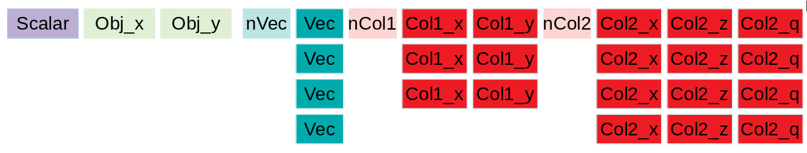

# Natual Analysis Implementation Language

## Data model
The event data used is of 4 different types
- scalars (one number per event)
- vectors (multiple entries per event, with variable number of entries)
- objects (sets of a fixed number of scalars per events representing different properties of the same object)
- collections (a variable number of objects per event)

Each property of an object in a collection can be seen as a simple vector, but all the vectors representing individual properties have the same length.
Each property of singleton object is just a scalar.

I.e. the data of a single event can be seen as split on an fixed size horizontal axis, with some "per object" or "per collection" grouping, and on a variable size vertical axis that is not only different event by event but also different for different objects.

A naming convention is assumed so that length of vectors and collections are named _nNameOfCollection_ and properties of an object or a collection are named *NameOfCollection_property*

## Actions

##### Define
Define a variable of any type given some code snippet to compute it. It can reference any know variable (either a defined one or one known to be available in the input)
Requirements can be specified, a _requirement_ is a selection that must be fullfilled in order for the code to make sense (e.g. Muon_pt[1] make sense only if there are at least 2 muons)

##### Selection
An event selection defined with an expression that can be evaluated as True or False

##### SubCollection
While each column can be considered independently some sets of columns are properties of the same analysis object and hence can be considered as aligned (i.e. same index in the column correspond to the same object). The SubCollection action allows to thin the collection applying a selection on it. SubCollection generates a new variable for each input property of the original collection.

##### Distinct
Create a list of pairs of the given input collection and new colulmns with all object properties for the element 0 and 1 of the pairs.

##### TakePair
Extract an individual pair from a list of pairs creating new scalar columns for the properties of element 0 and 1 of the pair

##### ObjectAt
Extract an individual object from a collection creating new scalar columns for the properties of the object

##### MergeCollections
Merge two collections having all properties shared by the two input collections. If the user want to put dummy values for non shared properties it must do so with a prior define (e.g. merging Muon and Electron the user can _Define_ Electron_nMuonStations=-99 to have this variable appearing also in the merged collection)

##### Match
Matches two collections via DeltaR or a user specified metric in a non-unique way. For each element of collection A the closest element of collection B is computed and viceversa. Delta R and index of the matched object are defined. 

##### CentralWeight
Add a weight that has to be used when making nominal distribution (central value). CentralWeight can be called several times, the product of the weights will be the resulting nominal weight. The weight can be applied only to some phase space regions by specifying the list of selections the weight belong to (a selection inherit the product of the weight from selections that are listed as requirements)

##### VariationWeight
Add a systematic/variation weight. Those weights are applied in addition to central weight to evaluate systematic shifts. By default distribution made with those weight are not computed for distribution obtained with systematic variation of some input (i.e. we do not evaluate the effect of applying multiple systematics in one go)

##### VariationWeightArray
Same as VariationWeight but taking an array of weights in input and creating a different weight for each element. The number of elements to consider must be specified

##### inner looping operations and special keywords
Several operations can be defined to (inner) loop on an collection (e.g. the Muons).
In addition some special operations starting with "@" are implemented to simplify common operations

###### @p4, @p4v
@p4 and @p4v expand a collection name to get its pt,eta,phi,mass property and build a 4 vector. E.g. one can do
Define("Muon_p4","@p4v(Muon)") or Define("Muon0_p4","@p4(Muon[0])") or Define("Higgs_p4","@p4(Higgs)")

###### vector_map(function, collection_properties...) 
calls *function* on each element of the collection passing the listed properties as argument.
A variant vector_map_t<Type> exists to call a constructor of Type for each entry in the collection instead of calling the *function*.

##### MemberMap (preprocessor macro)
*MemberMap* allows to easily call a member of class A for each entry in a vector<A>
  
##### P4DELTAR 

###### operations defined in ROOT::VecOps
other operations are listed here https://root.cern.ch/doc/master/namespaceROOT_1_1VecOps.html 
and can be applied to inner vectors.
For example Max,Min,Argmax,Argmin, DeltaPhi, DeltaR, InvariantMass, 

## Yield
The output of the processing consists of histograms and ntuples. Histograms can be specified as a dictionary where for each selection a list of histograms is given. Ntuples are specified with a selection and a list of columns to store.

